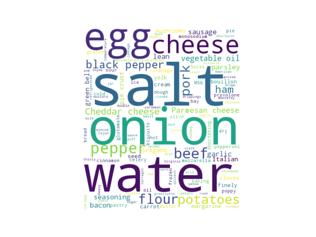
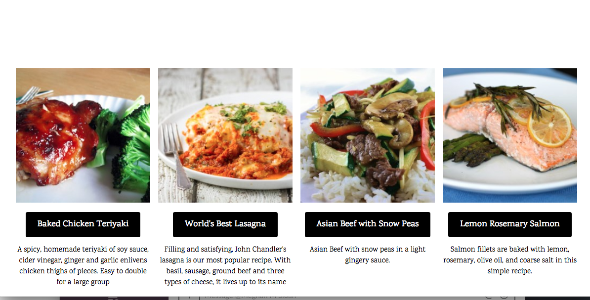
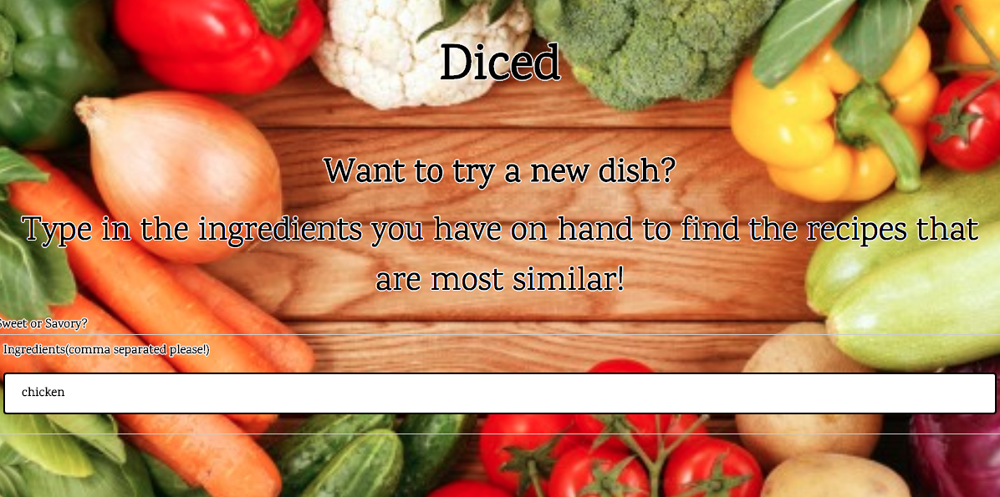
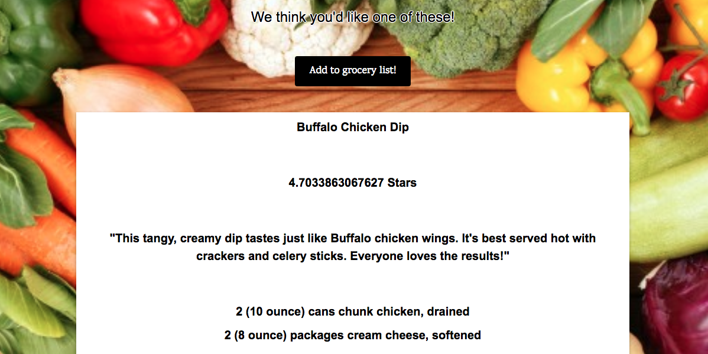
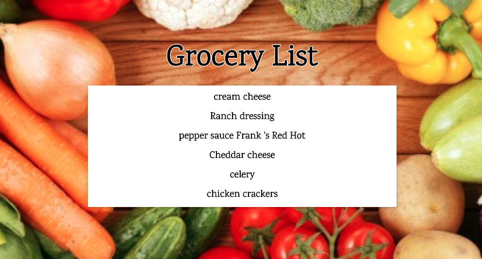

# Diced-capstone

1. [Concept](#concept)
2. [Data](#data)
3. [Data Storage](#data-storage)
4. [Natural Language Processing](#natural-language-processing)
5. [Modeling](#modeling)
6. [Web App](#web-app)
7. [Visualization](#visualization)
8. [Future Goals](#future-goals)
9. [Acknowledgments](#acknowledgments)

### Concept
The goal of this project is to create a recipe recommender system that will produce recipe suggestions based on ingredients the user has on hand. This app will also provide ratings of the recipes based on the star ratings provided by the scraped data from Allrecipes.com. The remaining ingredients needed for the recipe will be added to a grocery list. There will also be a link to potential coupons and savings that can be had. A further goal would be to create user profiles that can rate recipes and get improved suggestions with time.

### Data
Data was scraped from Allrecipes.com using BeautifulSoup with an attempt to get a variety of recipes under topics such as dessert, dinner, and appetizers. These were then divided between two databases for sweet and savory recipes. It was stored in a MongoDB database with the following keys: item_name, ingredient_list, direction_list, stars, submitter_name, and submitter_desc.
show image of spacy tokens

### Data Storage
The data is kept in a MongoDB database due to its json like format.

| Combined                          | Direction_list | Ingred_list                 |Item_name              |Stars |Submitter_desc|
|:--------------------------------: |:--------------:|:---------------------------:|:---------------------:|:----:|:------------:|
|'cauliflower mozzarella_cheese...  |'Preheat oven...|'1 large head cauliflower... |Cauliflower Pizza Bites|4.588 |Just like...  |

### Natural Language Processing
  In order to recommend recipes the ingredient list column needs to processed. This includes removing stop words ('cup', 'teaspoon', etc), lower casing all words, and experimenting with different stemming and lemmatizing techniques to find the root words (changing 'apples' to 'apple'). The ingredients with multiple words were combined with underscores. This changed 'green pepper' to 'green_pepper' and helped to vectorize the data. The ingredients were vectorized with TF-IDF, which more heavily weighted the more 'rare' ingredients. This means that ingredients such as 'butter' and 'salt' were less indicative of similarity.

### Visualization

    

### Modeling
The similarity of recipes was found by comparing the cosine similarity of the users input ingredients and the cosine similarity of the recipes in the MongoDb database. This returns the most similar recipes and they are also ranked by stars to see which is the most similar and the tastiest. Extra bonus would be t make a hybrid recommender.

### Web App
A web app using flask will be developed and run on AWS. This app offers popular recipes on the landing page as well as recommended recipes and the ability to create grocery lists.

    

     

    

     

    

     

    

### 8. Future Goals
I would like to scrape user profiles from Allrecipes so that I can create a hybrid recommender system. These profiles will be ones that have rated multiple recipes and using their ratings I will be able to predict other well liked recipes.

### 9. Acknowledgments
